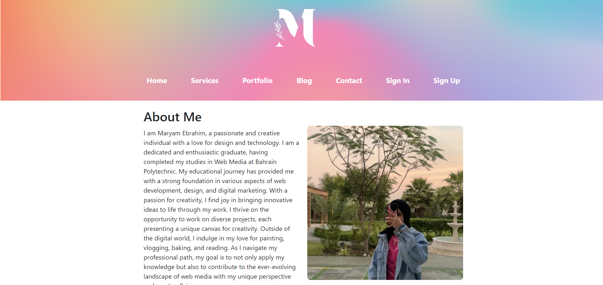

# Personal Website using MERN stack

## Description

This **Personal Website** is a full-stack application built using the **MERN stack** (MongoDB, Express, React, and Node.js). It serves as a comprehensive platform where I can showcase my portfolio, share blogs, and allow visitors to engage with the content through comments and contact forms. The project reflects my skills in web development, both on the client-side and server-side, with a strong emphasis on user experience and responsive design.

The website allows users to browse my portfolio and view detailed project descriptions. It also features a fully functional blog section where I share posts on various topics. Registered users can sign in to leave comments and interact with my blog posts. This platform demonstrates my ability to create dynamic web applications with authentication and CRUD functionality.

The inspiration behind building this website was to create a space where I could centralize my creative work and provide a seamless, engaging user experience for visitors. Whether someone is interested in viewing my portfolio, reading my blogs, or reaching out through the contact form, this website brings everything together in one place.

Backend application can be found [here](https://github.com/maryam1mohsen/personal-website-backend)

## Features

- **Portfolio Section**: A collection of projects I have worked on, with detailed descriptions and visuals.
- **Blog Section**: A space for sharing thoughts and articles, with the ability for users to leave comments.
- **Authentication**: Users can sign up, sign in, and access authenticated features such as commenting.
- **Contact Form**: Visitors can send messages directly through the website.
- **Responsive Design**: The website is fully responsive and optimized for various screen sizes.

## Attributions

- **[JWT](https://jwt.io/)** - JSON Web Token was used for implementing user authentication securely.
- **[bcrypt](https://www.npmjs.com/package/bcrypt)** - For password hashing and security.
- **[React Router](https://reactrouter.com/)** - For client-side routing to create a seamless, single-page application experience.
- **[Mongoose](https://mongoosejs.com/)** - For interacting with MongoDB and managing data schemas.
- **[Vite](https://vitejs.dev/)** - Used for fast build times and optimized development.

## Technologies Used

This project utilizes a modern stack of technologies that support full-stack development:

- **MongoDB**: A NoSQL database used to store user information, blogs, and portfolio items.
- **Express.js**: A minimal Node.js framework for building web servers and APIs.
- **React**: The JavaScript library for building dynamic user interfaces and single-page applications.
- **Node.js**: The JavaScript runtime environment used to build the back-end of the application.
- **JWT**: For user authentication and authorization, ensuring that sensitive areas are protected.
- **bcrypt**: For hashing passwords to enhance security.
- **CSS**: Used for styling the front end, with a focus on creating a clean, responsive layout.

## Next Steps

This personal website will continue to evolve with new features and enhancements. Below are some of the planned improvements for future releases:

- **Enhanced Portfolio Features**: Adding the ability for users to filter and search portfolio items by categories and tags.
- **Advanced Blog Functionality**: Implementing more robust blog search options, including filtering by date, tags, and categories.
- **Contact Form Validation**: Improving the contact form with real-time validation and better error handling.
- **Dark Mode**: Adding a toggle for light/dark mode to improve accessibility and user experience.
- **Animations & Transitions**: Enhancing the website's visual appeal with subtle animations and transitions using CSS and React libraries.
